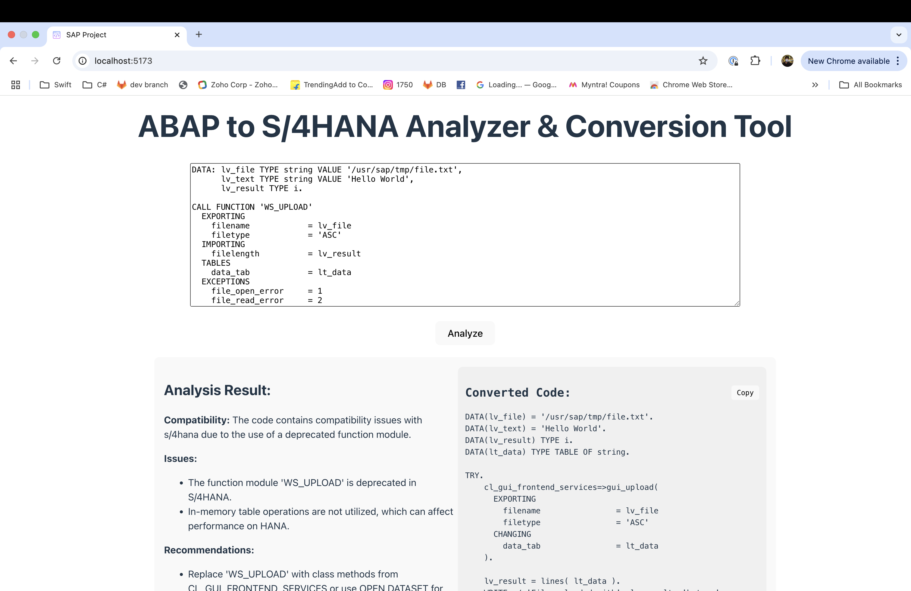

# ABAP to S/4HANA Analyzer & Conversion Tool

A web app that analyzes ABAP code for SAP S/4HANA compatibility, identifies deprecated functions, suggests modern replacements, and provides refactored S/4HANA-compliant code using OpenAI's API.

## Backend (my environment)

- Go to the `backend` folder.

  `cd backend`

- Create and activate a conda environment:

  ```
  conda create -n abap-analyzer python=3.13 -y
  conda activate abap-analyzer
  ```

- Install dependencies:

  `pip install -r requirements.txt`

- Create a .env file in backend/ with your OpenAI API key:

  `OPENAI_API_KEY=your_openai_api_key_here`

- Start the Flask server:

  `python app.py`

  API runs at http://127.0.0.1:5000.

## Frontend

- Go to the sap-frontend folder:

  `cd frontend`

- Install dependencies:

`npm install`

- Start the React app:

`npm run dev`

Frontend runs at http://localhost:5173.

## Sample Output


